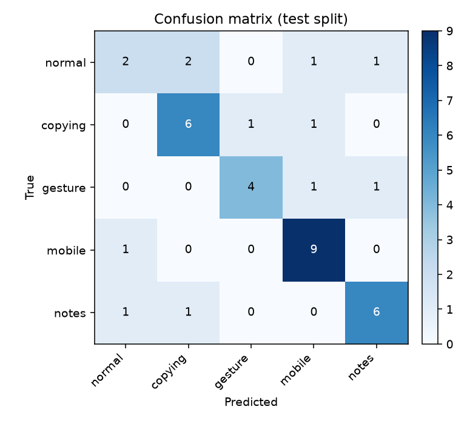
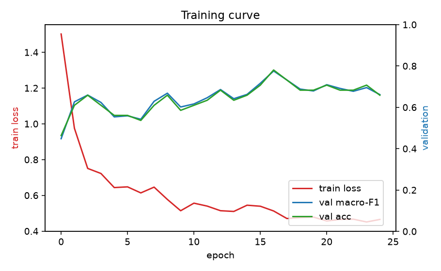
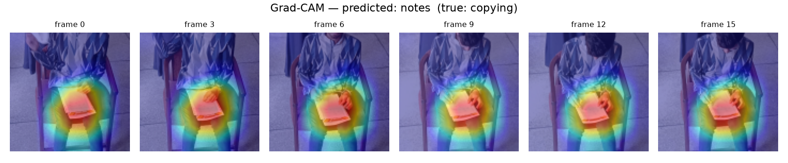
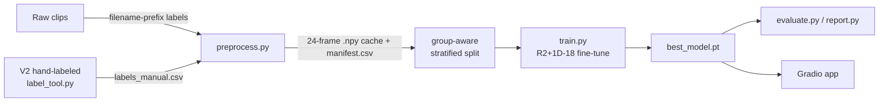

# 🎓 Exam Behavior Classifier

Video action-recognition that classifies a short clip of a single student into one of five
exam behaviors — **normal · copying · gesture · mobile · notes** — using an R(2+1)D-18 video CNN
fine-tuned from Kinetics-400.

[](https://github.com/MunkhbayarA/exam-cheating-detection/actions/workflows/ci.yml)


> ⚠️ **Research & education project — not a proctoring system.** Trained on a small dataset;
> outputs are suggestions for a human to review, never automated accusations. See
> [Limitations & Responsible Use](#-limitations--responsible-use).

> ▶️ **[Try it live](https://exam-behavior-classifier.streamlit.app)** — upload a clip, get a
> prediction with confidence scores.
> 🤗 **[Model on HuggingFace](https://huggingface.co/mbradiant/exam-behavior-classifier)** —
> weights + model card, loadable in 5 lines.

---

## Results

Held-out **test split**, group-aware (raw + cropped views of the same clip never cross splits,
so these numbers are leakage-free). Trained on 251 clips: 221 prefix-labeled + 30 hand-labeled
V2 clips from varied real-world cameras.

| Metric | Score |
|---|---|
| Test accuracy | **71.1%** |
| Macro-F1 | **0.680** |
| Classes | 5 |
| Test clips | 38 |

### The most interesting finding: a distribution gap

Hand-labeling the 30 V2 clips (phone footage, WhatsApp re-encodes, different rooms and cameras)
and adding them to the benchmark made the test set *harder* — and revealed how much the clean
V1 numbers flattered the model:

| Test subset | n | Accuracy |
|---|---|---|
| Original distribution (V1 + cropped sample) | 33 | **78.8%** |
| New hand-labeled V2 footage | 5 | **20.0%** |
| Overall | 38 | 71.1% |

On its original distribution the model is as strong as the earlier 221-clip baseline
(81.2% on the old 32-clip test set — statistically the same at this sample size). On genuinely
out-of-distribution footage it collapses. Cross-domain generalization — not more epochs — is
the real frontier for this dataset, which is why per-student cropping of the V3–V5 lecture-hall
footage is the top roadmap item.

<p align="center">
  
</p>

<p align="center">
  
</p>

### What is the model actually looking at?

Grad-CAM overlays show the model attends to the **hands-and-paper** region when predicting
paper-related classes — evidence it learned behavior-relevant features rather than background
shortcuts:

<p align="center">
  
</p>

---

## How it works



- **Input:** 16 frames sampled uniformly from a clip, center-cropped to 112×112, Kinetics-normalized.
- **Model:** torchvision `r2plus1d_18` (Kinetics-400 pretrained), 5-way head, fine-tuned with
  discriminative LRs (backbone 1e-4, head 1e-3), class-weighted cross-entropy + label smoothing,
  cosine schedule, mixed precision, early stopping.
- **Leakage-safe splits:** clips are grouped by `clip_id` and stratified by class, so augmented
  views of one clip cannot straddle train/test.

## Project structure

```
src/
  preprocess.py   build labeled manifest + cache frame stacks (ingests labels_manual.csv)
  label_tool.py   keyboard-driven clip labeler (real cross-clip undo)
  dataset.py      group-aware stratified split + augmentation
  train.py        fine-tune R(2+1)D-18, logs reports/history.csv
  evaluate.py     test-split metrics
  report.py       confusion matrix, per-class report, training curve, metrics.json
  gradcam.py      "what the model looks at" heatmaps
  inference.py    shared model loading + clip preprocessing
  predict.py      CLI: classify any clip
streamlit_app.py  live demo (Streamlit Cloud; pulls weights from the HF model repo)
app/app.py        Gradio demo for local use (same inference path)
tests/            CPU unit tests (incl. the no-leakage split invariant)
reports/          generated figures + metrics
model_card.md     intended use, limitations, ethics
```

## Reproduce

```bash
# 1. environment (GPU build of torch first — see requirements.txt for the CPU option)
pip install torch==2.5.1 torchvision==0.20.1 --index-url https://download.pytorch.org/whl/cu121
pip install -r requirements.txt

# 2. (optional) label the V2 clips yourself
python src/label_tool.py

# 3. build the dataset cache + manifest, train, evaluate, make figures
python src/preprocess.py
python src/train.py
python src/evaluate.py
python src/report.py

# 4. try it
python src/predict.py path/to/clip.mp4
python app/app.py           # web demo
```

Run the tests:

```bash
pytest -q
```

## Dataset

[**ExamCheating_MultiV**](https://www.kaggle.com/datasets/rimmajeed/examcheating-multiv-video-based-dataset)
(Kaggle, ~24 GB — not included in this repo). Download and extract to `archive/`:

```
archive/
  V1/V1/*.mp4            labeled clips (filename prefix = class: nor/c/g/m/n)
  V2/V2/*                mixed clips — hand-labeled with label_tool.py
  V3..V5/                raw wide-angle lecture-hall footage (unlabeled)
  sample_of_our_preprocessed_data_224x224_cropped_clips/
```

V1 and the 224×224 cropped sample carry labels in their filename prefixes; V2 is hand-labeled.
The wide-angle lecture-hall footage (V3–V5) is intentionally left unlabeled — a single clip-level
label is meaningless for a frame full of students; per-student cropping is future work
(see [Roadmap](#roadmap)).

## 🔒 Limitations & Responsible Use

This is a **research and education** project, not a deployable proctoring tool.

- **Small, noisy dataset** → high variance and limited generalization to new rooms, cameras, and
  students. Reported metrics come from a small test split.
- **Bias risk** → what "copying" or "gesture" looks like varies by culture, body type, and
  disability; the data does not control for this. The model can be systematically wrong for
  under-represented groups.
- **Label subjectivity** → `normal` / `gesture` / `copying` boundaries are genuinely ambiguous.
- **Privacy** → behavior surveillance raises consent and privacy concerns independent of accuracy.

**Intended use:** a technical demonstration of a reproducible, leakage-safe video-classification
pipeline. Any prediction should be treated as, at most, a prompt for a human to look closer —
never as evidence to accuse or penalize a student. Full details in [`model_card.md`](model_card.md).

## Roadmap

- [x] Hand-label V2 and retrain (done — exposed the distribution gap above)
- [x] Publish the model to HuggingFace + deploy a live demo (Streamlit Cloud)
- [ ] Per-student detection + cropping (YOLO) to unlock the V3–V5 lecture-hall footage
- [ ] Temporal ensembling / test-time augmentation for steadier predictions

## License

MIT — see [LICENSE](LICENSE).
